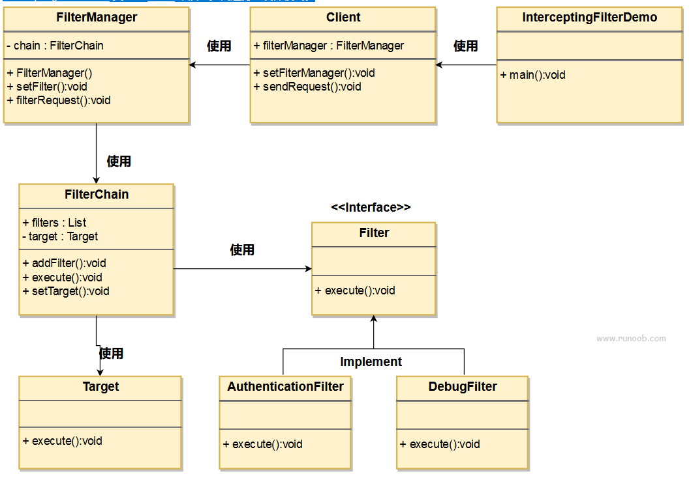

#拦截过滤器模式

拦截过滤器模式（Intercepting Filter Pattern）用于对应用程序的请求或响应做一些预处理/后处理。定义过滤器，并在把请求传给实际目标应用程序之前应用在请求上。过滤器可以做认证/授权/记录日志，或者跟踪请求，然后把请求传给相应的处理程序。以下是这种设计模式的实体。

    过滤器（Filter） - 过滤器在请求处理程序执行请求之前或之后，执行某些任务。
    过滤器链（Filter Chain） - 过滤器链带有多个过滤器，并在 Target 上按照定义的顺序执行这些过滤器。
    Target - Target 对象是请求处理程序。
    过滤管理器（Filter Manager） - 过滤管理器管理过滤器和过滤器链。
    客户端（Client） - Client 是向 Target 对象发送请求的对象。

#实现

我们将创建 FilterChain、FilterManager、Target、Client 作为表示实体的各种对象。AuthenticationFilter 和 DebugFilter 表示实体过滤器。

InterceptingFilterDemo 类使用 Client 来演示拦截过滤器设计模式。

